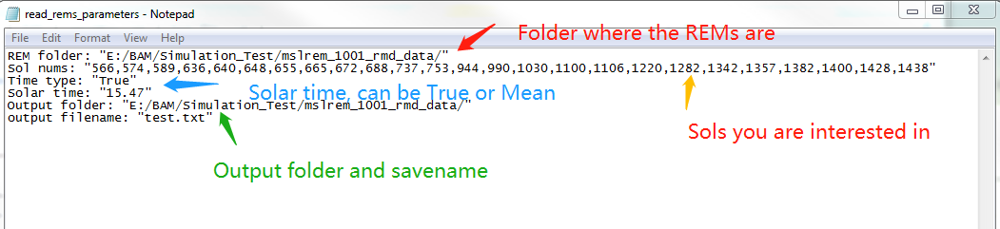
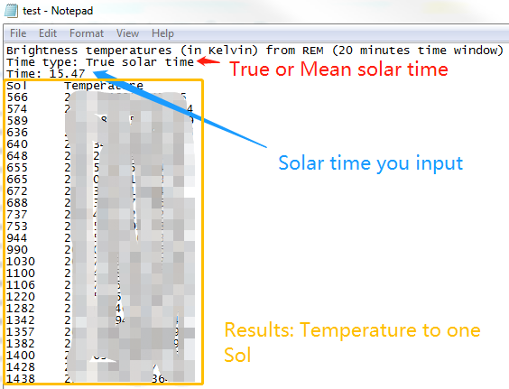

# Retrieving temperature from REM data based on sols and solar time
This is the [python3](https://www.python.org/downloads/) and assume you have already installed these libraries:\
[Pandas](https://pandas.pydata.org/), [NumPy](http://www.numpy.org/).

**Input**: parameter txt file as . Please note that change everything inside " ".

**Output**: Temperatures txt file as .

**Steps**:

1. Download Read_REM_data.py.
2. Open command windown and go to the directory you save Read_REM_data.py.
3. Type *python Read_REM_data.py* in the command line.
4. Type into the parameter file name (including path) such as E:/parameter.txt
5. When the command window shows the word "Done!", the results are availabe under the output folder you gave in the parameter file.
